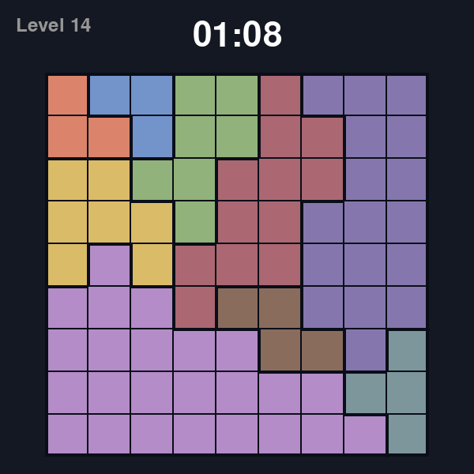
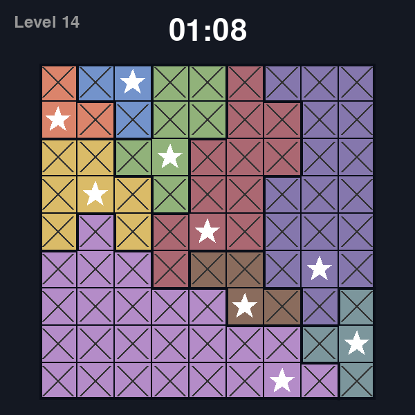

# Starstruck (Star Battle) Python Clone 🌟

A complete, procedurally generated clone of the logic puzzle game "Starstruck" (also known as Star Battle), built from scratch using Python and Pygame. 

This project features a custom game engine, a Depth-First Search (DFS) backtracking solver for mathematical uniqueness, and a multi-core batch generator to conquer the combinatorial explosion of complex graph topologies in larger grids.




##  Features

* **Procedural Level Generation:** Uses randomized multi-source Breadth-First Search (BFS) to organically grow Tetris-like region boundaries.
* **Deterministic Solver Engine:** Implements recursive DFS with aggressive tree-pruning to guarantee every generated puzzle has exactly *one* valid solution.
* **Multi-Core Batch Generation:** Leverages Python's `ProcessPoolExecutor` to distribute the heavy computational load of 9x9 Hard Mode generation across all available CPU threads, serializing valid puzzles to a JSON database.
* **Interactive UI & Animations:** Features dynamic window resizing, translucent state-machine overlays, and a distance-based cascading animation queue for auto-marking invalid cells.
* **Progression System:** Reads from a local JSON database to provide a level-select screen, tracking and visually updating completed puzzles.
* **State Exporter:** Built-in tool to instantly export pristine `.png` images of both the initial and solved states of any puzzle.

##  Installation & Setup

1. **Clone the repository:**
```bash
git clone [https://github.com/GutoC7/Starstruck.git](https://github.com/GutoC7/Starstruck.git)
cd Starstruck

```


2. **Install dependencies:**
This project requires Python 3.12+ and Pygame.
```bash
pip install pygame

```


3. **Run the game:**
```bash
python src/main.py

```


##  Controls

* **Left Click:** Place/Remove a Star (★)
* **Right Click (or Drag):** Mark a cell as impossible (×)
* **ESC:** Pause Game / Return to Menu
* **1-4 / Numpad:** Menu Navigation & Level Selection

##  Architecture

The codebase is strictly decoupled to separate the mathematical logic from the visual rendering:

```text
src/
├── core/
│   ├── engine.py       # Manages matrix state, O(1) conflict tracking, and animation queues
│   ├── generator.py    # Region growth topology (Phase-based BFS)
│   └── solver.py       # DFS Backtracking uniqueness validator
├── puzzles.json        # Database of pre-calculated, verified levels
├── batch_generate.py   # Multi-threaded offline generator script
├── ui.py               # Pygame rendering, scaling, and state machine
└── main.py             # Application entry point

```

##  Generating Hard Mode Puzzles

Because 9x9 grids require strict topological constraints to ensure a unique solution, the solver discards millions of invalid configurations. To prevent the main thread from blocking, Hard Mode puzzles are generated offline.

To generate a new batch of puzzles using all your CPU cores:

```bash
python src/batch_generate.py

```
Beware that it took 2 hours to generate 20 puzzles running on a i710700F, so depending on your hardware it might even take longer.

This script will safely append new, mathematically verified levels to your `puzzles.json` file to be played in-game!

